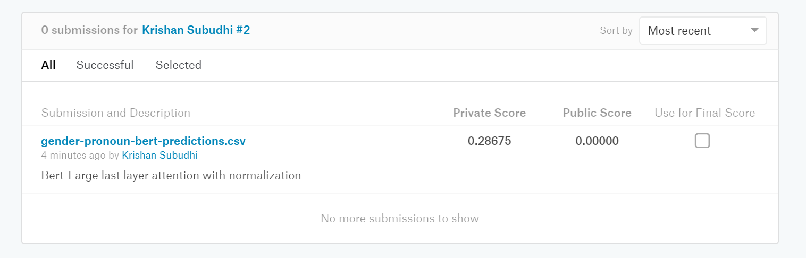

This is the solution to the famous Kaggle comptetion.
https://www.kaggle.com/c/gendered-pronoun-resolution/overview

The pytorch based solution utilizes BERT architecture to create a finetuned model.

Training and validation data: https://github.com/google-research-datasets/gap-coreference.git

# Goals

1. Create a working solution with good accuracy.
2. Compare different approaches.
3. Apply Distributed training using pytorch Distributed Data Parallel and Horovod. Document speed improvement.
4. Use NVIDIA apex library for 16 bit floating point precission (fp16). Show training speed and metrics.
5. Use azure ML to train. 
6. Use hyperdrive.
7. Predict and submit to kaggle.

# Steps

1. Boot a machine with at least one GPU

1. Clone the repo
```
git clone https://github.com/krishansubudhi/gendered-pronoun-resolution.git
```
2. `cd gendered-pronoun-resolution`
3. Download data

```
git clone https://github.com/google-research-datasets/gap-coreference.git
``` 

4. Preprocess: Convert text to tokens. Also find P , A and B position. Also add labels. The preprocessed data is stored as both tsv and pkl files. pkl file will be loaded for traning while tsv file is for readablility.

```
python PreprocessGapData.py
```

5. Run code in single GPU with default configurations.
```
python TrainGAP.py
```


# Solution

I have tried 3 types of architectures to solve this problem using Bert. To find the best among them Bert Base is used as the bert model.
Results can be obtained by running the **Experimentation** notebook.

## 1. Concatenation

logits = linear(concat(P_hidden, A_hidden, B_hidden))

**Results**
Epoch = 0, Val loss = 0.4355, val_acc = 0.8515 

## 2. Multiplication

This attends P over A,B start tokens and a random tensor for neigher case. Softmax is calculated over the logits

A_att, B_att = Attention of P wrt A and B/sqrt(hiddensize)
Neither_att = Attention of P wrt random tranable tensor/sqrt(hiddensize)

logits = A_att, B_att, Neither_att

**Results**
Epoch = 1, Val loss = 0.3918, val_acc = 0.8546

This method produces the best results so far. And this will be our baseline. 
Further hyper parameter tuning will be done on top of this architecture.

## 3. Segmentation

input = same as bert
input embedding ids = 1 for P, 2 For A, 3 for B, 0 for rest. 0 token type embeddings are initialized with pretrained weights. Rest of the weights are random.

A,B and P are only first tokens of their respective words
logits = linear(CLS_hidden)

**Results**
Epoch = 1, Val loss = 1.003, val_acc = 0.5176

This performs the worst among the three. Probable casue can be the addition of many untrained weights at the beginning of the pretrained model. Or segment ids are not useful at all. It needs further debugging.


## Running code on local machine (CPU)

    git clone https://github.com/google-research-datasets/gap-coreference.git
    PreprocessGapData.py --output_dir processed_data
    python TrainGAP.py --sample_limit 10 --input_dir processed_data


#  Distributed training

There are multiple ways to do distributed traing. For example pytorch DP, DDP and horovod are different libraries. Then there is nccl and gloo backends. Also there are multiple ways to start multi process training. We will discuss all of them and cgive a comparison of all.

For all the setting, these are the constants.

Total batch size for 1 optimizer step = 32
epochs = 1
learning ratee = 2E-5
Machine used = Azure NC12_promo
torch.cuda.get_device_name(0)
'Tesla K80'

Performance is a bit slow in the K80 GPUs. Will benchmark in V100s after AzureML integration.

## Single node single process performance


GPU | Training loss |Time taken for epoch 1 |Val loss, val_acc |
--- | --- | --- | --- |
K80 | 0.243 | 389 s|0.3918, 0.8546 |
V100 | 0.46 | 78 s| 0.44, 0.825 |

## Starting multiple process
Refer the notebooks Multiprocess1 and Multiprocess2 for running disstributed data parallel training using 2 processes. Needs a VM with 2 GPUS.

Also the notebook mp_spawn shows easier way to start multiple processes in one command using pytorch multiprocess spawn method.

### Performance with single node 2 processes

K80 GPUS

|Backend|Training loss (process1,process2) |Time taken for epoch 1 |Val loss, val_acc |
|--- | --- | --- | --- |
|DDP GLOO| 0.409, | 256 s|0.449, 0.8458 |
|DDP NCCL| 0.409, | 212 s |0.449, 0.8458 |
|DDP NCCL FP16| 0.5, 0.29 | 370 s |0.449, 0.8458 |
|Horovod NCCL| 0.589, 0.342 | 208 s |0.413, 0.837 |

V100 GPUS

|Backend|Training loss (process1,process2) |Time taken for epoch 1 |Val loss, val_acc |
|--- | --- | --- | --- |
|GLOO| 0.441, 0.301 | 218 s| - |
|NCCL| 0.549, 0.212 | 179 s | - |

Conclusion: Multiprocess traning is faster than single process training. NCCL is faster then GLOO. In V100s, NCCL with two processes only consumed 61% of single node time while GLOO took 75% of single node time which is still faster but not very efficient.

Hence rest of the experiments will be done with NCCL backend only.

The reason why FP16 is slower in K80s is because tesor cores are present only for V100s. Possibly the monkey patching is worsening performance in K80s. Needs more testing.

### Performance with multi node 

For multi node training I booted two azure VMs in same location and resource group. I opened port 29500 in the VM I was going to use for rank 0. More details on this [blog](https://krishansubudhi.github.io/deeplearning/2019/10/15/PyTorch-Distributed.html)

K80

#### DDP

All the commands can be found in the [MultiNode.ipynb](MultiNode.ipynb) notebook

|Nodes,Processes|Training loss |Time taken for epoch 1 |Val loss, val_acc |
|--- | --- | --- | --- |
|2 nodes, 2 processes| 0.43, 0.267 | 333 s |0.416, 0.841 |
|2 nodes, 4 processes| 0.37, 0.43, 0.25, 0.46 | 297 s | 0.43, 0.84 |
|2 nodes, 4 processes, FP16| 0.1, 0.76, 0.16, 0.44 | 342 s | 0.4, 0.84 |

2 nodes 2 process decreased the speed while 2 nodes 4 process improved the speed. The intuition is with more number of processes, the communicaiton time is constant but the parallelisation improved. But this needs more analysis.

Previously with 4 processes my the performance has degraded. The reason was I was not reducing batch size per GPU hence the overall batch size was consant. Since I kept my learning rate constant, the higher batch performance was bad. The current result has per gpu batch size = 8 for 4 processes. and 16 for 2 processes making the overall batch size = 32 in both the cases.

#### Horovod

Horovod involves 2 steps
1. Installing mpi, horovod and nccl 
2. making all nodes to be able to ssh between each other

[Horovod documentation](Horovod.md)

All the commands can be found in the [horovod_install.ipynb](horovod_install.ipynb) and [horovod_multinode.ipynb](horovod_multinode.ipynb) notebook

|Nodes,Processes|Training loss |Time taken for epoch 1 |Val loss, val_acc |
|--- | --- | --- | --- |
|2 nodes, 2 processes| 0.614, 0.324 | 272 s |0.42, 0.843 |
|2 nodes, 4 processes| 0.495, 0.147, 0.082, 0.597 | 221 s | 0.417, 0.834 |

Todo: Why horovod performance is slightly worse than DDP?

Horovod is faster than vanilla DDP. The reason can be the fact that horovod avoids reduction at every step if GA > 1 

    optimizer = hvd.DistributedOptimizer(optimizer, named_parameters = model.named_parameters(), backward_passes_per_step = args.gradient_accumulation)

In horovod code,

    self._allreduce_delay = {v: self.backward_passes_per_step
                                 for _, v in sorted(named_parameters)}
                                                            

## Mixed precission tranining
[Using APEX](fp16.md) 


# AML

[Docuementation on AML](aml.md)

Notebook : [run_aml.ipynb](run_aml.ipynb)

Since AML directly supports Horovod, I will try running this wihtout any changes with use_horovod flag.
This works out of the box. 

For DDP I had to make certain changes where I fetch the ranks, world size and master node information from environment variables.

## Apex in AML


Apex needs to be built from source for the latest changes. Hence it can't be installed through the pip package argument option in pytorch estimator.

For this reason a docker image needs to be created with all the required dependency. Since this docker image will install everything in a python environment, we will use that environment in aml
```python
                    #Docker image
                    use_docker=True,
                    custom_docker_image=image_name,
                    user_managed=True)
estimator._estimator_config.environment.python.interpreter_path = '/opt/miniconda/envs/amlbert/bin/python'
```
For DDP the docker image I created is =  'krishansubudhi/transformers_pytorch:1.3'

This contains the binaries of latest apex and pytorch 1.3. This also contains transformers

[Dockerfile](dockerfiles/Dockerfile)

Since this did not contain horovod, I used the docker image created by Abhishek Rao which has both apex and horovod.

    [10/24 1:34 PM] Abhishek Rao
        My docker image is abhishekraok/spaceorca:1.3.2

[Dockerfile](dockerfiles/horovod-apex-abhishek/Dockerfile)


# Hyperdrive
Hyperdrive [Documentation](aml.md) link can be found in the aml documentation.

Notebook = [aml_hyperdrive.ipynb](aml_hyperdrive.ipynb)

Best Run Id:  Testing-AML-hyperdrive_1572883987357281_8

 Accuracy: [0.9030837004405287, 0.8744493392070485, 0.8898678414096917, 0.9096916299559471]

 params: ['--input_dir', 'processed_data', '--isaml', '--epochs', '1', '--fp16', '--val_batch_size', '32', '--bert_type', 'bert-large-uncased', '--epochs', '4', '--lr', '3E-05', '--model_type', 'mul', '--per_gpu_batch_size', '32']


# Kaggle Submission
The prediciton dataset does not have any lables. Those data alsmo need to go through all the preprocessing steps.

1. Find  the best hyper parameters using hyperdrive.
2. Combine training and validation data during preprocessing.
2. Run training on all data using best hyper parameters.
3. Run preprocessing on test data. Add dummy labels. 
4. Output validation set logits to output folder.

[Preprocess_TestData.ipynb](Preprocess_TestData.ipynb)
[final_training_prediction.ipynb](final_training_prediction.ipynb)

Kaggle submission score:


Results in : OneDrive\projects\gender-pronoun

# Things that could not be completed
1. Use CyclicLR
2. Experiment with more architecture.
3. Calculate confusion matrix and find areas where the model is not performing well.
4. Run FP16 with horovod. 
    
    * I couldn't run FP16 with horovod in VM becase my VMs being low priority got preempted and I did not want spend time configuring the VMs to ssh each other.

    * I couldn't use horovod with FP16 in AML because , I did not have a working docker image.